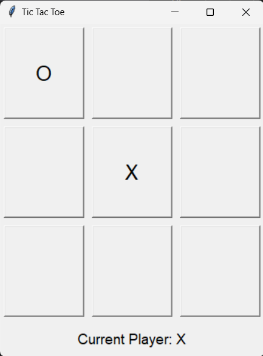

# Tic Tac Toe Game

Welcome to the Tic Tac Toe game developed using Python and Tkinter! 🎮✨

## About
This project was created as part of the InternPe Internships program, where I had the opportunity to enhance my programming skills and delve into GUI programming. The game provides an interactive and visually appealing experience, allowing players to compete against each other in the classic Tic Tac Toe game. ⭕️❌

## Features
- User-friendly interface with colorful buttons
- Turn-based gameplay
- Real-time updates on the current player
- Win detection for rows, columns, and diagonals
- Tie detection when the board is full
- Option to reset the game and play again

## Requirements
- Python 3.x
- Tkinter library

## cloning
git clone https://github.com/Ramsai170899/Tic-Tac-Toe_InternPe_Internship.git

## Screenshots

## Contributing
Contributions are welcome! If you have any ideas or improvements to suggest, please open an issue or submit a pull request. Let's make this game even better together! 🤝💡

## License
This project is licensed under the [MIT License](https://github.com/your-username/tic-tac-toe-game/blob/main/LICENSE).

## Acknowledgements
I would like to express my gratitude to the InternPe team for providing the platform and guidance during the InternPe Vitual Internship program. Their support and mentorship were instrumental in the development of this project.

If you have any questions or feedback, feel free to reach out. Enjoy playing Tic Tac Toe! Have fun! 🎉🎮
